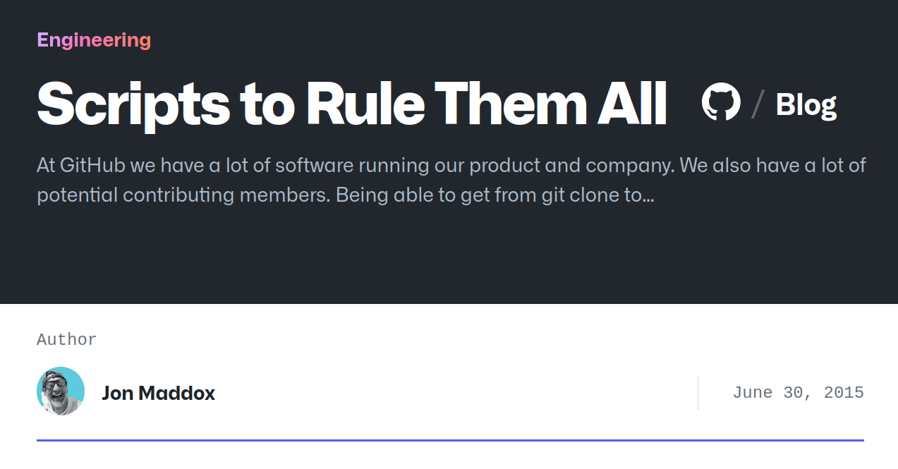

# Scripts To Rule Them All

---

Github Blog
---



<!-- newlines: 1 -->

> source: <https://github.blog/2015-06-30-scripts-to-rule-them-all>

<!-- end_slide -->

## Scripts To Rule Them All

---

Github Blog
---

<!-- newlines: 2 -->

```markdown
Being able to get from `git clone` to an up-and-running 
project in a development environment is imperative for
**fast**, **reliable** contributions.
```

> Emphasis mine

<!-- end_slide -->

## Scripts To Rule Them All

---

Github Blog
---

With practically every software project, developers need to perform the following tasks:

<!-- pause -->
<!-- incremental_lists: true -->

- bootstrap
- run tests
- run continuous integration
- start app

<!-- end_slide -->

## Scripts To Rule Them All

---

Github Blog
---

### Scripts
<!-- pause -->
<!-- incremental_lists: true -->

- `script/bootstrap` – installs/updates all dependencies
- `script/setup` – sets up a project to be used for the first time
- `script/update` – updates a project to run at its current version
- `script/server` – starts app
- `script/test` – runs tests
- `script/cibuild` – invoked by continuous integration servers to run tests
- `script/console` – opens a console

<!-- end_slide -->
## An Unexpected `syntax error near token ')'`

---

This isn't as easy as it seems
---

<!-- incremental_lists: true -->
<!-- pause -->

- every shell is created equal
- `bash` is everywhere
- everyone knows `bash`
- all shell scripts are idempotent
- you only ever need strings
- a script can tell you before hand it will work
- shell functions and scripts have clear in- and outputs
- `:(){ :|:& };:`

<!-- end_slide -->

## There And Bash Again

---

Maybe I should just use a programming language
---
<!-- incremental_lists: true -->
<!-- pause -->
### Benefits

<!-- pause -->
- type-safety
- zero dependency, single binary deploys
- full-on software development life cycle
- choose your own learning curve
- their own unique ecosystems and tooling

<!-- end_slide -->

## There And Bash Again

---

Maybe I should just use a programming language
---

#### Drawbacks

- type-safety
- zero dependency, single binary deploys
- full-on software development life cycle
- choose your own learning curve
- their own unique ecosystems and tooling

<!-- pause -->

<!-- newlines: 1 -->

```shell
#!/usr/bin/env bash
set -euxo pipefail
```

<!-- end_slide -->

## The Fellowship Of The Tasks

---

So, what *do* I want?
---
<!-- incremental_lists: true -->

A workflow tool should help me:

<!-- pause -->

- get new people up and running fast
- decouple tasks from the environment
- build guardrails around workflows
- document the tasks
- compose and re-use tasks
- make tasks idempotent
- make tasks easy to share
- determine order execution
- integrate in existing shell based workflows

<!-- end_slide -->

## Task, You Fools

---

🚀 Install Task
---

```bash +exec
sh -c "$(curl -sSfL https://taskfile.dev/install.sh)" -- \
  -d -b ~/.local/bin
```

<!-- end_slide -->
## Run, You Tasks

---

Happy Flows
---

<!-- column_layout: [1,1] -->

<!-- pause -->
<!-- column: 0 -->
### Local Server Flow

- `task bootstrap`
- `task server`
- `task call`

<!-- pause -->
### Local Testing Flow

- `task bootstrap`
- `task test`
- `task test --watch`

<!-- column: 1 -->
<!-- pause -->
### Remote Server Flow

- `task sync`
- `task k8s:logs`
- `task k8s:call`
- `task sync --watch`

<!-- pause -->

### Cleanup

- `task down`

<!-- end_slide -->
## Speak Task And Enter

---

How do I hold this thing?
---

```bash
task
task --summary bootstrap
task --summary server
task --summary sync
```

<!-- end_slide -->

## Speak Task And Enter

---

So, what's a task?
---

```bash
task --init && bat Taskfile.yml
```

```yaml +line_numbers {all|1|3,4|6,7|8,9|10|all}
version: '3'

vars:
  GREETING: Hello, World!

tasks:
  default:
    cmds:
      - echo "{{.GREETING}}"
    silent: true
```
<!-- end_slide -->

## Speak Task And Enter

---
<!-- newlines: 1 -->

```yaml +line_numbers {all|3,4,9-14|all}
version: '3'

include:
  utils: tasks/utils

vars:
  GREETING: Hello, World!

env:
  ENVIRONMENT: "dev"

dotenv: [.env, .envrc]

set: [pipefail]

tasks: ...
```
<!-- end_slide -->

## You Shall Not Task

---

Can it help me prevent layer 8 problems?
---
<!-- pause -->

### Preconditions

```yaml
preconditions:
  - sh: command -v curl > /dev/null
    msg: Please make sure curl is installed and in your $PATH.
```

<!-- pause -->
### Prompts

```yaml
prompt: "Delete the following items? {{.ITEMS_TO_CLEAN}}"
```
<!-- end_slide -->

## You Shall Not Task

---

Can it help me prevent layer 8 problems?
---

### Status

```yaml
status:
  - '[[ "$(gum --version)" == *"{{.GUM_VERSION}}"* ]]'
```
<!-- pause -->

### Requires

```yaml
requires:
  vars: [MANIFESTS]
```
<!-- end_slide -->

## Speak Task And Enter

---

🚀 Compact Tasks
---

```yaml +line_numbers
tasks:
  default: task --list
  vet: go vet ./...
  fmt: go fmt ./...
```

---

```bash +exec
task fmt vet
```
<!-- end_slide -->
## Speak Task And Enter

---

Task Sources
---

```yaml +line_numbers {all|6,7|4,5|all}
tasks:
  test:
    desc: "Runs all the project's tests."
    sources:
      - "**/*.go"
    cmds:
      - go test ./...
```

<!-- pause -->
---

```bash
task test
task test --watch
```

<!-- end_slide -->
## Speak Task And Enter

---

Task Generates
---

```yaml +line_numbers {all|4,5|6,7|all}
build:
  sources:
    - "**/*.go"
  generates:
    - ./bin/echo-server
  env:
    CGO_ENABLED: "0"
  cmds:
    - go build -o ./bin/echo-server ./cmd/echo-server/
```

> I've removed the `tasks`, `desc` and `summary` fields for brevity from this point onward.

<!-- end_slide -->
## Speak Task And Enter

---

Task Deps
---

```yaml +line_numbers {all|3,4|5|2|all}
server:
  aliases: [start, up]
  deps:
    - task: build
  watch: true
  cmds:
    - ./bin/echo-server
```

<!-- pause -->
---

```bash
task server
```

<!-- end_slide -->
## Speak Task And Enter

---

Task Variables
---

```yaml +line_numbers {all|2|3|3,4,5|3,6-9|3,10,11|12-14|12,15|all}
call:
  silent: true
  vars:
    ENDPOINT: '{{.ENDPOINT | default "localhost:8080"}}'
    MESSAGE: '{{.MESSAGE | default "🙈🙉🙊"}}'
    JSON_MESSAGE: |
      {
        "message": {{ .MESSAGE | quote }}
      }
    TMPFILE:
      sh: "mktemp"
  cmds:
    - echo {{.JSON_MESSAGE | quote}} > {{.TMPFILE}}
    - defer: rm {{.TMPFILE}}
    - curl -i http://{{.ENDPOINT}}/echo -d @{{.TMPFILE}}
```

<!-- end_slide -->
## Speak Task And Enter

---

🚀 Task Variables
---

```bash +exec
task call
```
<!-- end_slide -->
## Speak Task And Enter

---

🚀 Task Variables
---

```bash +exec
task call MESSAGE='Hello, World!'
```
<!-- end_slide -->
## Speak Task And Enter

---

Task Debugging
---
>
> Adding `--dry` will not even execute any commands!

```bash
task call --verbose
```
<!-- end_slide -->
## Speak Task And Enter

---

Task Prompt & For Loops
---

```yaml +line_numbers {all|3|4,5|6|8-10|all}
clean:
  silent: true
  ignore_error: true
  vars:
    ITEMS_TO_CLEAN: ["./bin", "./tmp", "./.task"]
  prompt: "Delete the following items? {{.ITEMS_TO_CLEAN}}"
  cmds:
    - for:
        var: ITEMS_TO_CLEAN
      cmd: rm -rv {{.ITEM}}
```

> You can combine `for` with `sources` to loop over folders and files!

<!-- end_slide -->
## Questions

---

Thank You
---

<!-- newlines: 4 -->

### Rio Kierkels

#### <https://github.com/rio/tasks-to-rule-them-all>

##### <https://hachyderm.io/@rio>

###### <https://linkedin.com/in/rio-kierkels>
